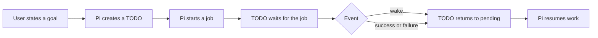

# Using Pi Jobs, TODOs, and Workflows

This guide describes practical use of the local Pi extensions. The easiest approach is to state requests in natural language; Pi calls the `todo`, `jobs`, `bg_start`, and `workflow` tools as needed.

## Core model



- **TODO** stores work, dependencies, and reasons for waiting.
- **Job** monitors a long-running command, WebSocket, or HTTP endpoint without blocking Pi.
- **Background terminal** runs a simpler process without conditions or TODO integration.
- **Workflow** divides larger work among isolated agents.
- All processes and monitoring run only while Pi runs. Exiting Pi terminates the complete process tree.

## TODO tasks

### Normal task flow

For example, write:

> Create a TODO named “Fix login,” mark it in progress, and complete it when done.

Pi follows this state flow:

```text
pending → in_progress → completed
                    ↘ waiting:user
                    ↘ waiting:jobs
```

Normally, only one task should be `in_progress` at a time.

### Adding work to the queue

`/todo add <request>` immediately stores the exact request without steering current work. A cheap background model changes only the display subject and decides whether repository inspection would materially prepare implementation. For complex tasks, one read-only Pi subagent runs serially with limits of eight turns and two minutes. It stores verified scope, affected paths, proposed steps, risks, and candidate questions in `metadata.preparation`.

Preparation never changes requirements or task status and never wakes the main agent. Every transition uses a per-TODO token and monotonic version. Editing or starting the task invalidates stale output and settles preparation fail-open. When processing the task later, the main agent first calls `todo get` and verifies prepared information against current code.

When the last visible task completes, the scheduler asks the agent for a completion review. This is a requirement-completeness check, not a code review: it approves when the result and concrete evidence plausibly satisfy every explicit request and rejects only a named material omission, contradiction, missing mandatory check, or plainly premature closure. Workspace diffs are supporting context, so missing diff visibility, committed work, baseline restoration, or an incomplete bounded overlay cannot cause rejection by themselves. If work is missing, the agent creates TODOs and continues. Otherwise, it calls `todo clear`, which archives the completed batch as `deleted` instead of erasing it, then sends one final report. `todo clear` rejects the operation while any pending, in-progress, or waiting task exists. Two completion reviews without state changes pause automation to prevent a loop.

The final report preserves work context:

1. **Outcome** — what the user can do now.
2. **Before → now** — previous behavior or root cause and new behavior.
3. **Key code changes** — file paths and short before/after or diff excerpts for non-trivial changes, without a large raw diff.
4. **How it works now** — resulting flow and component relationships.
5. **Verification** — exact commands and results.
6. **Usage or manual step** — only when the user must do something.
7. **Remaining caveats** — risks, deliberate omissions, or `none`.

Small changes receive short reports. Larger changes include enough implementation context and relevant excerpts that the user does not need the earlier agent conversation.

### Viewing TODOs

- `/todos` opens the interactive list.
- You can also write: `show all TODOs`.
- Deleted entries are tombstones and remain hidden by default.

### Dependencies

> Create a TODO named “Deploy API” blocked by task #3.

After the blocking task completes, Pi can continue the unblocked work.

### Waiting for the user

Use this only when Pi needs a concrete answer:

> Set TODO #4 to waiting:user and store the questions “Which environment?” and “What deadline?”

Questions are stored exactly. Pi later shows them together without repeated wakeups.

## Jobs

### When to use a job

Jobs suit:

- dev servers or watchers,
- long builds or tests,
- CI waits,
- periodic HTTP checks,
- WebSocket events,
- processes whose output should wake a TODO.

Use a job proactively when a command will likely exceed 30 seconds and independent TODO work can continue, when external state would otherwise be checked more than once, or when an event should wake later work. At the first repeated manual status check, replace polling with a bounded monitor. Keep blocking shell execution for short one-shot checks whose result is immediately required; a monitor should provide concurrency, event-driven wakeup, or reusable observation rather than merely wrap a command.

### Viewing and managing jobs

- `/jobs` shows all jobs.
- `/jobs job-1234` shows details and recent events.
- Natural-language requests also work: `stop job job-1234`, `restart it`, or `delete it`.

Available tool actions are `start`, `status`, `list`, `get`, `stop`, `restart`, and `delete`.

### Command job

Example prompt:

> Start `bun run dev` as a command job named “Frontend dev server.” Wake TODO #2 when output contains `ready`. Set a ten-minute timeout.

For reliable conditions, make the monitored process emit one complete text or JSON event per line.

### Regex condition

> Start the test watcher as a job. Mark the job as failed when a line matches `Tests: .* failed`.

Condition actions:

- `wake` — wakes linked TODOs while the monitor keeps running,
- `complete` — successfully settles the job,
- `failure` — settles the job as failed.

### JSONPath condition

If the process emits:

```json
{ "type": "ready", "count": 1 }
```

request:

> Monitor JSON lines. Wake when `$.count` is greater than `0`.

Supported operators are `exists`, `equals`, `notEquals`, `in`, `matches`, `greaterThan`, and `lessThan`.

### Linking a job to a TODO

Recommended prompt:

> Create a TODO named “Verify API startup,” start the API as a job, and set the TODO to waiting:jobs with a 120-second timeout. When a ready event arrives, verify state, stop the job, and complete the TODO.

Important behavior:

1. `wake` returns the TODO to `pending` and stores evidence.
2. The monitor keeps running.
3. To await another event, Pi sets the TODO to `waiting:jobs` again.
4. A successful job never completes a TODO automatically; it only unblocks it.

A TODO can wait for multiple jobs in either mode:

- `any` — the first wake or settlement is enough,
- `all` — waits for every job.

### Timeout and deadline

Always bound waits:

> Wait for the job for at most five minutes. On timeout, wake the TODO and continue diagnosis.

A timeout never authorizes a fallback production action.

### Restart after session recovery

- A normal interrupted command job becomes `interrupted`.
- Only an explicitly idempotent command job may restart.
- WebSocket and HTTP monitors require fresh network-scope approval after recovery.

## HTTP and WebSocket monitoring

HTTP monitor example:

> Check `https://example.test/status` every five minutes. Wake the “Check alert” TODO when `$.status` equals `FIRING`. Use the exact host, port, and HTTPS scope.

WebSocket monitor example:

> Connect to `wss://example.test/events`, monitor `$.severity == "critical"`, and wake the TODO on a match.

Security rules:

- Pi requests approval for the exact host, scheme, port, and pinned IP addresses.
- Credentials embedded in URLs are rejected.
- DNS address changes require new approval.
- Private or local addresses are identified as restricted scope.

## Background terminals

Use background terminals for simple long-running processes that need no conditions or TODO wakeups:

> Start `bun run storybook` in a background terminal named “Storybook.”

Commands:

- `/ps` — interactive process list,
- the agent uses `bg_start`, `bg_status`, `bg_list`, and `bg_kill`.

Use `jobs` instead when you need a timeout, output monitoring, or TODO integration.

## Workflows

Workflows suit audits, parallel research, implementation, and independent verification.

Request one explicitly with the word `workflow`:

> Workflow: inspect backend and frontend in parallel, fix confirmed defects, then run review and tests.

Or:

> Ultracode this task: audit → implementation → dogfood → final review.

Workflows support phases, parallel agents, structured results, deadlines, and per-agent `maxTurns`.

Every attempt defaults to and cannot exceed 12 total model/tool turns. The final two turns are reserved for reporting, so usable work is `max(0, maxTurns - 2)`: `maxTurns: 4` provides two work turns and two handoff turns. Normal tools become unavailable during the reserve so an oversized task returns a useful handoff instead of spending its last turn on another command. Before authoring a workflow, estimate orientation, edit, and focused-check cycles, then set the explicit total cap to work turns plus two; never increase it automatically. Use `maxTurns: 6–8` for planning/review and split any implementation likely to need more than 10 tool-capable work turns.

A child tool call is capped at three minutes; requesting more fails immediately. Split focused checks, and return long full builds or test suites to the parent for `jobs` monitoring. Do not bundle formatting, full build, and tests in one child command.

Use `openai-codex/gpt-5.6-luna` for fast, low-risk children only: read-only inspection or mechanical edits, no more than four tool-capable work turns and three files, with a deterministic check. Four work turns require explicit `maxTurns: 6`; `maxTurns: 4` is under-budget for that estimate and must be split or rescoped rather than silently increased. Keep domain modeling, security, money, database/migration, concurrency, and production decisions on the inherited stronger model. Any ambiguity or failed verification escalates rather than retries on Luna.

For local work that can safely continue over a dirty shared worktree, `maxContinuations: 1` permits one fresh isolated attempt after a turn-limit failure or a structured `{ status: "partial" }` result. The schema must distinguish `done`, `partial`, `blocked`, and `failed`; use `blocked` only for a real prerequisite or contradiction. Continuations share the original deadline, consume the 32-agent-call budget, inspect the diff before editing, and retain the same external-mutation restrictions.

### Workflow safety boundary

Child agents may analyze and edit their assigned local worktree. They cannot:

- commit, push, merge, switch, reset, clean, or otherwise mutate Git branches/history,
- deploy,
- modify clusters, secrets, or production,
- start background jobs,
- use unknown direct tools,
- perform external mutations.

The parent agent must perform such actions after explicit approval.

## Recommended prompts

### Dev server followed by testing

> Create one TODO for starting the application and another for browser testing. Start the dev server as a job, wait for a ready JSON event, then run the browser test. Finally stop the server and complete both TODOs.

### CI monitor

> Start the local CI command as a job. Set the TODO to waiting:jobs. On success, continue review; on failure, read the latest output and fix the root cause. Use a 20-minute timeout.

### Continuous alert monitor

> Start a five-minute HTTP alert monitor. On every FIRING event, wake the TODO, process the alert, then set the TODO to waiting:jobs again. Do not stop the monitor until I explicitly ask.

### Larger task

> Workflow: first run two read-only audit agents, let one agent fix confirmed problems, and let the final agent run tests and review. No commit, push, or external mutation.

## Steering a running conversation

While the agent works, enter a message in the editor and submit it according to the desired behavior:

| Key         | Behavior                                                                                                                                               |
| ----------- | ------------------------------------------------------------------------------------------------------------------------------------------------------ |
| `Enter`     | Queues a steering message. Current assistant turn finishes already-started tool calls, then the agent receives the message before its next model turn. |
| `Alt+Enter` | Queues a follow-up. The message arrives only after all current work completes.                                                                         |
| `Escape`    | Immediately aborts the current flow and returns queued messages to the editor. You can then submit a new instruction.                                  |
| `Alt+Up`    | Returns queued steering and follow-up messages to the editor.                                                                                          |

Use `Enter` to redirect work without losing the current tool result. It does not interrupt a running shell command or tool midway; it inserts the message at the next safe boundary. To stop the current tool or flow, use `Escape`, then submit a new instruction.

Current `steeringMode: one-at-a-time` delivers one steering message after each completed assistant turn. Change this through `/settings`; `all` delivers every queued steering message together.

## Shutdown and recovery

On `/new`, `/resume`, `/fork`, `/reload`, or Pi exit:

- old background processes terminate,
- command jobs persist as interrupted or restart safely only when explicitly idempotent,
- TODO state and evidence rebuild from persistence; interrupted background preparation settles fail-open, and actionable pending work resumes automatically even when sibling tasks are waiting,
- WebSocket and HTTP polling stop outside a running Pi process.

The system intentionally has no separate daemon. Nothing is monitored while Pi is closed.

## Quick reference

| Need                               | Use                 |
| ---------------------------------- | ------------------- |
| View TODOs                         | `/todos`            |
| View jobs                          | `/jobs`             |
| View job details                   | `/jobs job-id`      |
| View background terminals          | `/ps`               |
| Simple long-running process        | background terminal |
| Process with timeout or conditions | job                 |
| Make a TODO wait for a process     | `waiting:jobs`      |
| Ask the user a concrete question   | `waiting:user`      |
| Run parallel multi-phase work      | workflow            |

## Most important rules

1. A job only unblocks a TODO; it never completes it automatically.
2. `wake` leaves a continuous monitor running.
3. After processing a wake event, activate or re-arm the TODO again.
4. Always bound long operations with a timeout or deadline.
5. Production and external mutations require explicit scope and parent execution.
6. No jobs or background processes remain running after Pi exits.
