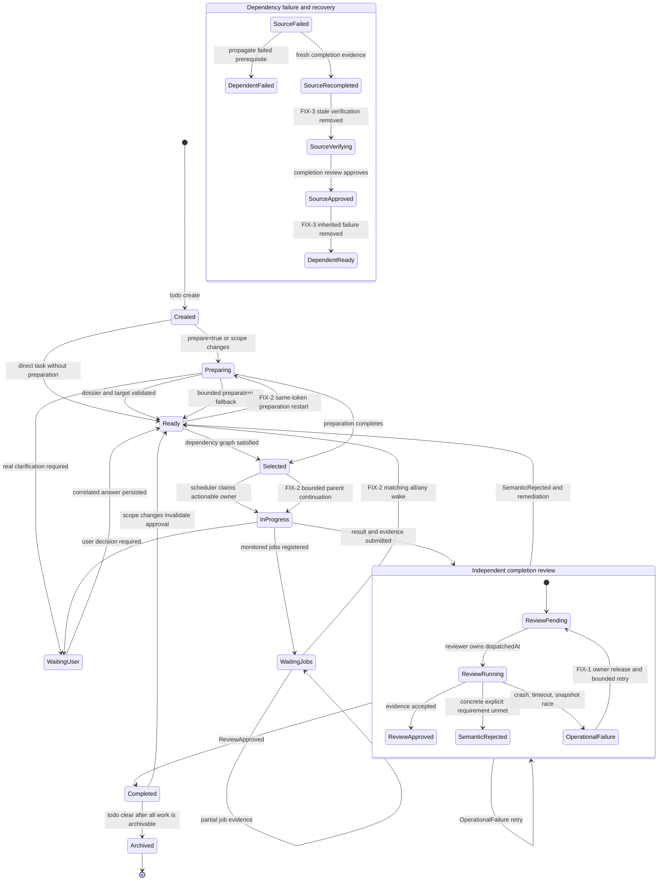

# TODO lifecycle

The persisted task status and the public status are related but not identical. A task with persisted `status: completed` and `review.status: pending` is shown publicly as `verifying` until independent review approves it.

## Corrected bug map

| Marker    | Broken behavior                                                                                                                 | Corrected transition or boundary                                                                                              | Regression evidence                                                                                                                                                      |
| --------- | ------------------------------------------------------------------------------------------------------------------------------- | ----------------------------------------------------------------------------------------------------------------------------- | ------------------------------------------------------------------------------------------------------------------------------------------------------------------------ |
| **FIX-1** | A reviewer exception could leave `review.status: pending` with no active owner and no future dispatch.                          | Every review run re-arms retry from its common `finally` boundary after removing active ownership.                            | `extensions/todo/completion-review-orphan-retry.test.mjs`                                                                                                                |
| **FIX-2** | A job or review approval could expose a pending task without restarting its queued preparation or waking the parent.            | Job/review wake → ready → same-token preparation restart → actionable selection → bounded parent continuation.                | TODO scheduler wake and descendant-continuation regressions in `extensions/todo/state/enhancements.test.mjs` and `extensions/todo/todo-orchestrator-acceptance.test.mjs` |
| **FIX-3** | Old failed verification metadata survived fresh completion and kept descendants displayed as stale `failed prerequisite` tasks. | Fresh completion removes superseded verification failure; propagation removes inherited failure while preserving `blockedBy`. | `extensions/todo/state/inbox.test.mjs`                                                                                                                                   |
| **FIX-4** | Unsupported persisted reviewer selectors could repeatedly fail after reload.                                                    | Reviewer model normalization occurs before dispatch; narrowly recognized obsolete-model failures are requeued on replay.      | `extensions/todo/state/completion-operational-exhaustion.test.mjs`                                                                                                       |
| **FIX-5** | A rejected `ask_user` UI promise skipped deadline cleanup and held the vendor Node process open.                                | Deadline cleanup now executes in `finally` for success, cancellation, and rejection.                                          | `vendor/pi-tools/extensions/ask-user/context.test.ts`                                                                                                                    |
| **FIX-6** | Large dirty worktrees could lose a review baseline or exceed blob-diff capture limits.                                          | Baselines accept 128 paths and 64 KiB metadata; blob capture is bounded before the 24,000-character overlay truncation.       | Boundary and large-blob regressions in `extensions/todo/state/enhancements.test.mjs`                                                                                     |

## Actionable selection and continuation

1. `selectReadyTasks` excludes unresolved dependencies, user waits, job waits, cycles, and active owners.
2. The scheduler selects one actionable owner and may reorder multiple ready tasks without violating dependencies.
3. A matching job event persists terminal evidence and changes its waiter to `pending`.
4. If that transition exposes a same-token queued preparation, the preparation queue is restarted.
5. When preparation or completion-review approval exposes executable work, the scheduler requests one bounded parent continuation.
6. The continuation revalidates task revision, lifecycle, target, and ownership before changing the task to `in_progress`.

## Completion review recovery

Operational failures do not ask the user to approve broken infrastructure. The review remains pending, releases `dispatchedAt`, waits for bounded backoff, and is redispatched. Retry scheduling is armed from the common review-run `finally` boundary after active reviewer ownership is released, preventing a pending/verifying task from becoming orphaned.

Semantic rejection is different: it returns the task to actionable remediation and requires changed completion evidence before another review.

Completion review verifies requirement completeness; it is not a code-quality or architecture review. The reviewer approves when the result and concrete evidence plausibly satisfy every explicit requirement and rejects only a named material gap, contradiction, missing mandatory check, or plainly premature closure. The bounded workspace diff supports this judgment but is not an absolute proof boundary. Missing diff visibility, an unavailable baseline, baseline restoration, an incomplete overlay, committed work, or evidence from a validated external worktree cannot cause rejection by themselves.

## Dependency recovery

A semantic source failure marks descendants with `failed prerequisite`. Fresh completion evidence removes stale failed verification metadata while preserving unrelated metadata and `blockedBy` edges. Once the source is no longer a semantic failure, propagation removes inherited failure metadata and descendants become ready again.

## Clear and UI semantics

`todo clear` refuses unresolved, rejected, waiting, or unreviewed work. It archives only completed tasks with approved completion evidence and preserves unresolved tasks.

`herdr:blocked` is reserved for actual user input or approval. Preparation, completion review, subagents, and jobs are background work. A job wait is displayed with a running marker such as `▶ running · mode: jobs` rather than pretending the user is blocking it.

## Verification evidence

Release-specific commits and test counts belong to Git history and completion-review evidence rather than this lifecycle contract. Changes to these transitions must retain focused lifecycle regressions and pass the repository checks defined in `package.json`.
